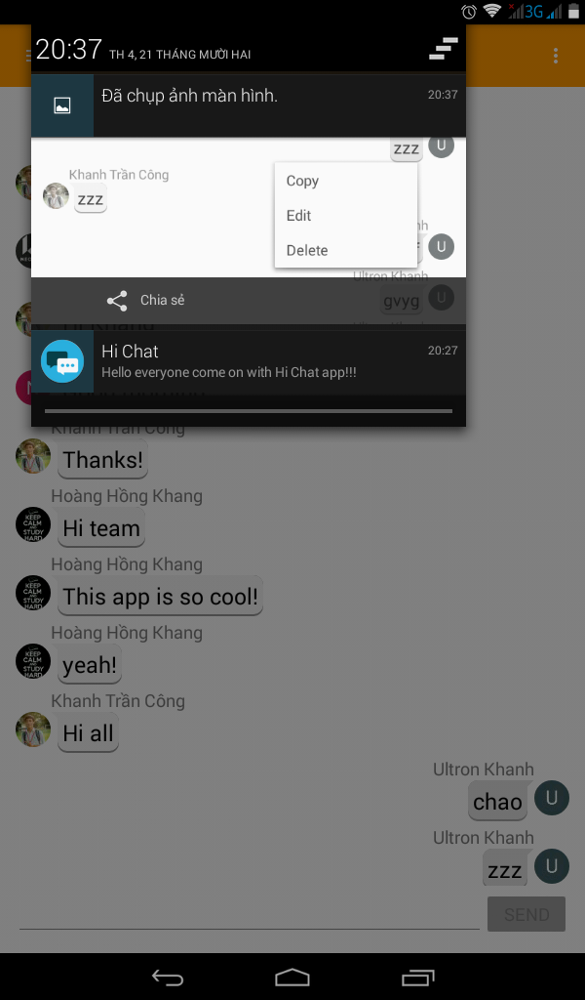

# HiChatFirebase
======
Hi Chat is an application which use Firebase.
* [Video Demo Youtube](http://bit.ly/2hV7xkD)

Download app
====== 
* [HiChat-release.apk](http://bit.ly/2h9Tp67)

Pre-requisites
======
- Pre-requisites

Login
=====

Chat Windown and Navigation View to show List User online, all of them use Recycle View
=====

Copy message to clipboard
======

New user of new message will be show
======

Online config
=========

Edit or Delete my message sent
======

Notification
======

Menu
========

